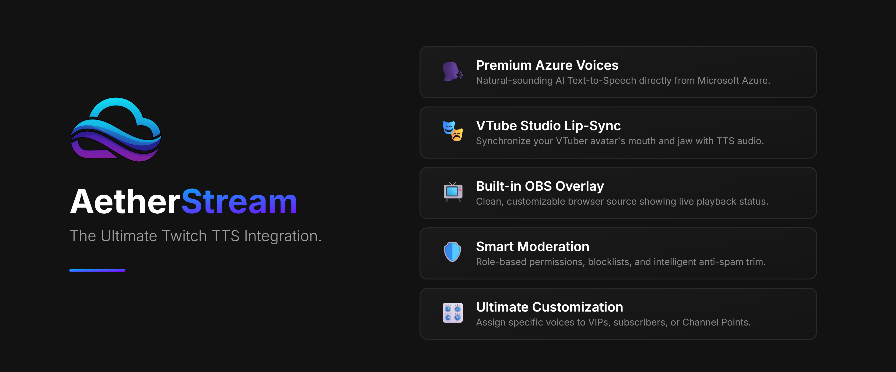

# 🎙️ AetherStream

> **Elevate your Twitch streams with crystal-clear, natural-sounding Text-to-Speech.**

AetherStream is a lightweight, highly customizable desktop application designed specifically for streamers. It connects directly to your Twitch chat and uses powerful Azure AI voices to read messages aloud. Whether you are a traditional streamer or a VTuber, AetherStream brings a new level of interactivity to your community.

---

## ✨ Key Features

Unlike basic robotic TTS tools, AetherStream gives you complete control over how your chat sounds and integrates seamlessly with your stream setup.

- 🗣️ **Premium Azure Voices:** Ditch the robotic voices. Use high-quality, natural-sounding AI voices from Microsoft Azure.
- 🎭 **VTube Studio Lip-Sync:** VTuber friendly! Connect directly to VTube Studio to synchronize your avatar's mouth and jaw movements with the TTS audio.
- 📺 **Built-in OBS Overlay:** Features a built-in local web server for a clean, customizable OBS browser source overlay showing live TTS status.
- 🛡️ **Smart Moderation:** Keep your stream safe. Includes role-based permissions (Subs, VIPs, Mods), link blocking, ignore lists, and intelligent spam reduction (automatically shortens "WAAAAAAA" to "WAA").
- 🎛️ **Ultimate Customization:** Fine-tune the global voice style, speed, pitch, and volume to match your stream's vibe.
- 🎁 **Channel Points Integration:** Create specific, unique voice rules tied directly to your Twitch Channel Point rewards.
- 👑 **User-Specific Voices:** Give your VIPs, mods, or favorite regulars their own custom TTS voice and pitch.
- 🎨 **Customizable UI & Performance:** Choose from multiple Light and Dark themes, pick your accent colors, and toggle animations off to save CPU/GPU resources on lower-end PCs.
- 🌍 **Multilingual App:** The user interface is available in **English, Hungarian, German, Spanish,** and **French**.

---

## 🚀 Getting Started

Getting your chat talking takes only a few minutes.

### Prerequisites
Before you begin, you will need:
1. A **Twitch Account**.
2. An **Azure Speech Services API Key** and Region. (The free tier provides plenty of hours for streaming!).

<b>🔑 Click here for a quick guide on how to get a Free Azure API Key</b>

Getting an Azure key is free and does not require you to pay for the basic tier.

1. Go to the [Azure Portal](https://portal.azure.com/) and sign in or create a free Microsoft account.
2. In the search bar at the top, type **"Speech Services"** and select it.
3. Click **"Create"** to make a new Speech resource.
4. Fill in the details:
   - **Subscription:** Your free subscription.
   - **Resource Group:** Create a new one (e.g., `AetherStreamGroup`).
   - **Region:** Pick the region closest to you (e.g., `West Europe` or `East US`). *Remember this region, you will need it in the app!*
   - **Name:** Give it a unique name (e.g., `MyAetherTTS`).
   - **Pricing Tier:** Select **Free F0** (This gives you 500,000 characters per month for free).
5. Click **"Review + create"**, then **"Create"**.
6. Once deployment is complete, go to the resource.
7. On the left menu, click **"Keys and Endpoint"**.
8. Copy **Key 1** and your **Location/Region**. Paste these into AetherStream's settings!

### Installation
1. Head over to the [Releases](../../releases/latest) page.
2. Download the latest installer for your operating system.
3. Install and launch **AetherStream**.

### Configuration
1. Go to the **Azure** settings tab inside the app.
2. Enter your **Azure API Key** and select your **Region**.
3. Go to the **Twitch** tab and connect your account via the built-in authorization.
4. Pick your default voice, hit test, and you are live!

---

## 🔄 Automatic Updates

You don't need to check GitHub every day. AetherStream checks for new releases automatically. If a new version is out, you can review the changelog and start the installer directly from inside the app.

---

## 🛠️ Built With

For the curious developers, AetherStream is built using modern web and desktop technologies to ensure it's fast and lightweight:

- **[Tauri](https://tauri.app/):** For a secure, resource-friendly desktop footprint.
- **[Vite](https://vitejs.dev/):** For lightning-fast frontend tooling.
- **Twitch API & Azure Cognitive Services**

---

## 🔒 Privacy and Safety

We take your stream's security seriously:
- **Local Storage:** All your settings, including API keys, are stored locally on your machine.
- **No Tracking:** We don't track your chat or collect your data.
- **Secure Updates:** The auto-updater strictly accepts trusted HTTPS GitHub hosts for installer downloads.

---

## 📄 License

This project is licensed under the **PolyForm Noncommercial 1.0.0** license. 

- ✅ Personal/private use and modification are allowed.
- ❌ Commercial use is strictly prohibited.

See the [LICENSE](LICENSE) file for the full text.